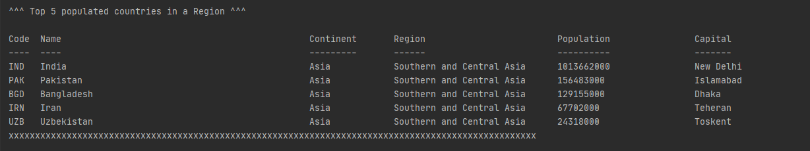
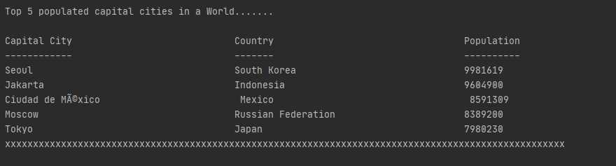

# Group - 8 README file

- Build Status for Master 
- Build Status for develop 
- Code Coverage 
- License 
- Releases 

| ID | Name | Met | Screenshot |
| ------- | ----------- | ------- | ----------- |
| 1 | All the countries in the world organised by largest population to smallest. | Yes | 
| 2 | All the countries in a continent organised by largest population to smallest. | Yes | 
| 3 | All the countries in a region organised by largest population to smallest. | Yes | 
| 4 | Top 5 populated countries in the world. | Yes | 
| 5 | Top 5 populated countries in a Continent. | Yes | 
| 6 | Top 5 populated countries in a Region. | Yes | 
| 7 | All the cities in the world organised by largest population to smallest. | Yes | 
| 8 | All the cities in a continent organised by largest population to smallest. | Yes | 
| 9 | All the cities in a region organised by largest population to smallest. | Yes | 
| 10 | All the cities in a country organised by largest population to smallest. | Yes | 
| 11 | All the cities in a district organised by largest population to smallest. | Yes | 
| 12 | Top 5 populated city in the world. | Yes | 
| 13 | Top 5 populated city listed by country continent. | Yes | 
| 14 | Top 5 populated city listed by country region. | Yes | 
| 15 | Top 5 populated city listed by country name. | Yes | 
| 16 | Top 5 populated city listed by city District. | Yes | 
| 17 | All the capital cities in the world organised by largest population to smallest. | Yes | 
| 18 | All the capital cities in a continent organised by largest population to smallest. | Yes | 
| 19 | All the capital cities in a region organised by largest to smallest. | Yes | 
| 20 | Top 5 populated capital cities in a World. | Yes | 
| 21 | Top 5 populated capital cities in a continent. | Yes | 
| 22 | Top 5 populated capital cities in a region. | Yes | 
| 23 | The population of people, people living in cities, and people not living in cities in each continent. | Yes | 
| 24 | The population of people, people living in cities, and people not living in cities in each region. | Yes | 
| 25 | The population of people, people living in cities, and people not living in cities in each country. | Yes | 
| 26 | The population of the world. | Yes | 
| 27 | The population of a continent. | Yes | 
| 28 | The population of a region. | Yes | 
| 29 | The population of a country. | Yes | 
| 30 | The population of a district. | Yes | 
| 31 | The population of a city. | Yes | 
| 32 | Most used Languages and world population percentage . | Yes | 